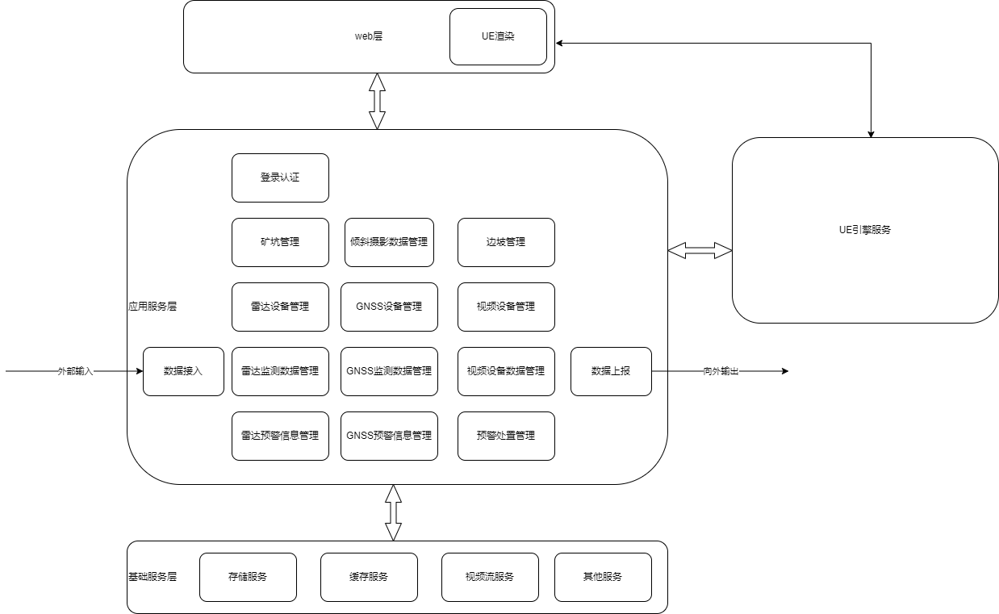
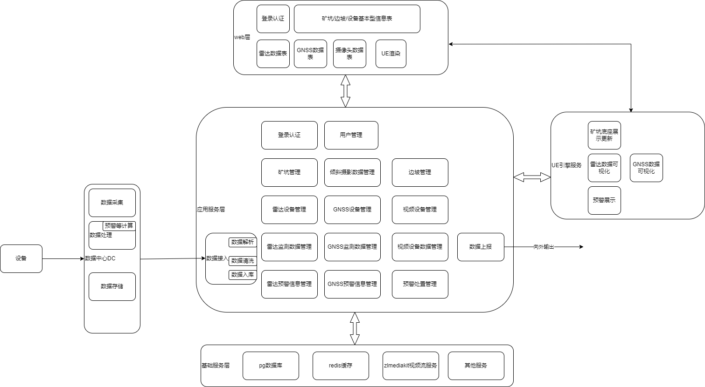
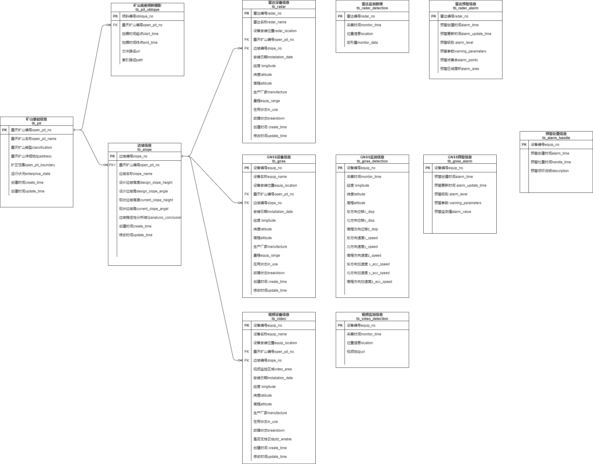

# 鄂尔多斯数字孪生 - 设计

## 项目简述

数字孪生煤矿可视化、3D建模、分析平台

## 需求分析

- 数据接入

- 数据上报

- 可视化展示
  - 图表展示
  - 3D建模展示
  - 视频播放

- 
- 数据分析
  - 报警分析
  - 报警处理

## 概要设计

系统概要架构图

## 详细设计

### 系统详细设计图

### 模块设计

#### 数据接入

- 接入数据类型
  - GNSS
  - 地基雷达
  - 视频
- 接入方式
  - 设备原始数据接入
  - 外部平台数据接口接入
- 接入要点
  - 接入频率
  - 接入数据量级、存储要求
  - 实时性要求、方式
- 接入步骤
  - 数据解析
  - 数据清洗、校准
  - 数据入库

#### 数据上报

- 数据上报类型
  - 矿坑基本信息
  - 边坡基本信息
  - 设备（雷达、GNSS、摄像机等监控设备）基本信息
  - 设备监控数据
  - 预紧信息
- 数据上报方式
  - 接口定义
- 接入要点
  - 接入频率
  - 实时性要求
- 上报步骤
  - 数据整合
  - 数据上报

#### 信息可视化

- 图表展示
  - 矿坑基本信息
  - 边坡基本信息
  - 设备基本信息
  - GNSS、雷达等监控数据
- 3D建模展示
  - GNSS监控数据
  - GNSS预警数据
  - 雷达监控数据
  - 雷达预警数据
- 视频播放
  - 视频数据的播放

#### 数据分析

后期...

### 技术选型

##### 前端

- vue3

##### UE端

- ue5
- pixel streaming

##### 后端

- midway
- postgresql
- redis
- zlmediakit

### 库表设计

ER图

#### 说明

### 接口设计

见apifox...

## 开发

## 部署

### 基础环境

### 部署方式

## 